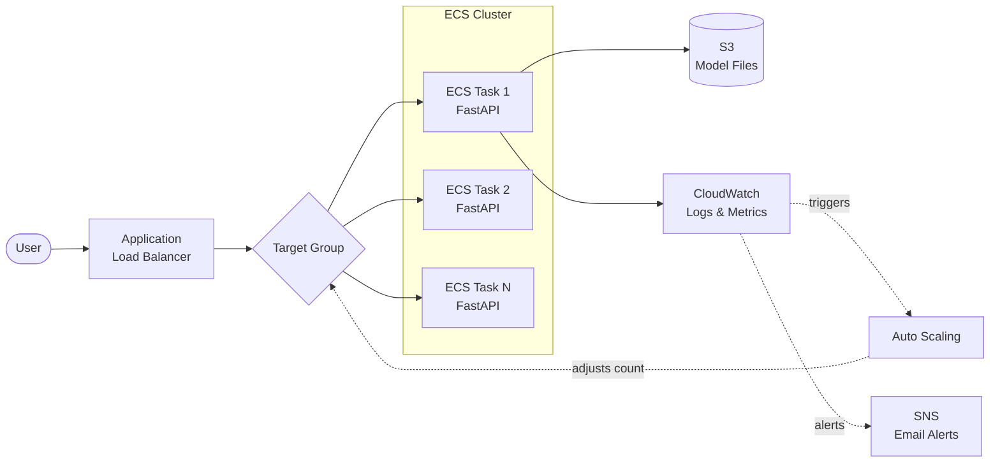

# Production Deployment & Operations
## ALB · ECS Fargate · Autoscaling · CloudWatch · Load Testing · Documentation

> **Level:** Beginner-friendly (assumes you completed the AWS Fundamentals tutorial)
> **Goal:** By the end you'll have a load-balanced, auto-scaling FastAPI API on ECS Fargate, with monitoring, alarms, and documentation proving it handles real traffic.

---

## Setup Checklist

From earlier tutorials you should have: AWS CLI v2, Docker, a FastAPI image pushed to ECR, and the `ecsTaskExecutionRole` IAM role. New for this tutorial:

```bash
pip install locust   # load testing tool (Hour 5)
```

### Cost Warning

This tutorial uses services outside the free tier. An ALB costs ~$0.025/hour, Fargate ~$0.01/hour for the smallest size. A full day of learning runs $1–3. **The cleanup steps at the end of each exercise are not optional** — an ALB left running for a month costs ~$18.

---

---

# Hour 1 — Deploy: Setup (ALB & Target Groups)

## Why You Need a Load Balancer

In the Fundamentals tutorial you accessed your ECS task by its public IP. That worked for testing, but it has three problems that make it unusable in production:

**The IP changes.** Every time the task restarts, scales, or gets replaced, it gets a new IP. You can't give users a URL if the address keeps moving.

**There are no health checks.** If your container crashes, traffic still tries to reach the old IP. Nobody is checking whether the container is actually alive.

**There's no distribution.** One container handles everything. When it's overwhelmed, every user suffers. There's no way to spread traffic across multiple containers.

An Application Load Balancer (ALB) solves all three. It gives you a stable DNS name that never changes, it continuously checks whether your containers are healthy, and it distributes incoming requests across however many containers you're running.

## How the ALB, Listener, and Target Group Relate

Think of it like a restaurant:

- The **ALB** is the front door — all customers enter here. It has a fixed address (a DNS name like `ml-api-alb-123.us-east-1.elb.amazonaws.com`).
- The **Listener** is the host stand — it checks what the customer wants ("traffic on port 80") and decides where to send them.
- The **Target Group** is the pool of available tables (your containers). The host only seats customers at tables that are clean and ready (healthy).

The ALB pings each container on a schedule (every 30 seconds by default). If a container fails several checks in a row, the ALB stops sending it traffic — even though the container is still technically running. When it recovers, the ALB adds it back.

### Q: Why can't I just use a fixed IP (Elastic IP) on my container?

You can for a single container, but it breaks the moment you want more than one. An Elastic IP points to one target. A load balancer points to many and distributes traffic. You also lose health-check-based routing — the Elastic IP sends traffic to the container whether it's healthy or not.

### Q: Does the ALB add latency?

A tiny amount — typically 1-3ms. You won't notice it. The benefits (stability, health checks, scaling) vastly outweigh this.

## The Security Group Chain

This is the most important networking concept in this hour. You're going to create **two** security groups that work together:

**ALB security group** — allows traffic from the internet on port 80. This is the only thing exposed to the outside world.

**ECS task security group** — allows traffic on port 8000, but *only from the ALB security group*. Not from the internet. Not from anywhere else.

This means even if someone discovers a task's IP address, they can't reach it directly. All traffic must flow through the ALB. This is called **defense in depth** — multiple layers of protection so that no single failure exposes your service.

### Q: Why not just open port 8000 to the internet on the task?

It works, but it defeats the purpose of the ALB as a security boundary. If the task is directly reachable, an attacker can bypass the ALB entirely — skipping your health checks, rate limits, and any future WAF (Web Application Firewall) rules you add.

### Q: Why do I need two subnets in different Availability Zones?

AWS requires this for ALBs — it's a hard rule, not a recommendation. The reason: if one AZ (data center) goes down, the ALB can still route traffic through the other AZ. Your default VPC already has subnets in multiple AZs, so you just need to look up two of them.

## The Target Group Health Check

When you create the target group, you specify a **health check path** — a URL the ALB will hit on each container to see if it's alive. If the container returns a 200 status code, it's healthy. If it returns anything else (or doesn't respond), it's unhealthy.

For FastAPI, `/docs` is a convenient health check endpoint because it always returns 200. In production you'd create a dedicated `/health` endpoint that also checks whether the model is loaded, the database is reachable, etc.

Two numbers matter here:

- **Healthy threshold** (default: 2) — how many consecutive successes before a target is marked healthy. This prevents a briefly-recovered container from receiving traffic too early.
- **Unhealthy threshold** (default: 3) — how many consecutive failures before a target is pulled from rotation. This prevents a single slow response from removing a container unnecessarily.

### Q: What's the difference between the ALB health check and the ECS container health check?

They're two different systems checking the same container for different reasons. The **ALB health check** decides whether to *route traffic* to a container. The **ECS health check** decides whether to *replace* a container. You need both — the ALB one for routing, the ECS one for automatic recovery.

> ⚠️ **Gotcha:** The target group's `target-type` must be `ip` for Fargate (not `instance`, which is the default). This can't be changed after creation. If you set it wrong, the target group silently stays empty — ECS registers tasks but they never appear as targets.

## ✏️ Hour 1 Exercise

**Goal:** Create the ALB infrastructure. All of this can be done in the AWS Console (EC2 → Load Balancers, and EC2 → Security Groups) if you prefer clicking over CLI.

1. Look up two subnet IDs from your default VPC in different AZs.
2. Create the ALB security group (allow port 80 from anywhere).
3. Create the ECS task security group (allow port 8000 from the ALB security group only — use the "source: security group" option, not a CIDR range).
4. Create the target group: HTTP, port 8000, target type `ip`, health check path `/docs`.
5. Create the ALB in the two subnets with the ALB security group.
6. Create a listener on port 80 that forwards to your target group.
7. Visit `http://<ALB-DNS-name>` — you should see `503 Service Unavailable`. That's correct: the ALB is working, but no targets are registered yet.

Save your ALB DNS name, target group ARN, and ECS security group ID — you need them in Hour 2.

---

---

# Hour 2 — Deploy: ECS Service Behind the ALB

## What Changes Compared to the Basics Tutorial

In the Fundamentals tutorial, you created an ECS service that gave each task a public IP and you connected directly. Now the architecture changes:

**Before:** User → Task (public IP on port 8000)
**After:** User → ALB (port 80) → Target Group → Task (port 8000, no direct access)

The key difference in the ECS service creation is one new parameter: `loadBalancers`. This tells ECS to automatically register every task it starts with your target group — and deregister tasks when they stop. You never manually add or remove targets; ECS and the ALB coordinate automatically.

## The Task Definition — What's New

Your task definition needs a few additions for production use:

**A container health check.** This is the ECS-level check (separate from the ALB check). It runs a command inside the container — typically `curl -f http://localhost:8000/docs || exit 1` — and if it fails repeatedly, ECS considers the task unhealthy and replaces it.

**A start period.** ML models can take 30-60 seconds to load into memory. Without a start period, ECS runs the health check immediately on startup, sees the container isn't ready yet, marks it unhealthy, kills it, starts a new one — and you get an infinite restart loop. Setting `startPeriod: 60` gives the container 60 seconds of grace time before health checks count.

**Log configuration.** Sending container stdout/stderr to CloudWatch Logs so you can debug without SSH. Set `awslogs-create-group: true` so the log group is created automatically.

### Q: Why desired count 2 instead of 1?

Two reasons. First, availability — if one task crashes, the other keeps serving traffic while ECS replaces the dead one. With a count of 1, every crash means downtime. Second, the ALB requires at least one healthy target to return 200 instead of 503. With two tasks, you can survive one failure without users noticing.

### Q: Do I still need `assignPublicIp=ENABLED` if traffic comes through the ALB?

Yes — and this trips up almost everyone. The public IP isn't for receiving user traffic (that goes through the ALB). It's for *outbound* internet access: pulling your Docker image from ECR, sending logs to CloudWatch, and downloading model files from S3. Without it, the task can't reach the internet and hangs at PROVISIONING forever with no useful error message.

In a production VPC you'd use a NAT Gateway or VPC Endpoints instead, but for a default VPC with public subnets, `assignPublicIp=ENABLED` is the way.

## Rolling Deployments

When you push a new image to ECR and tell ECS to update (`update-service --force-new-deployment`), ECS doesn't kill everything and start fresh. It does a **rolling deployment**:

1. Starts new tasks with the updated image
2. Waits for them to pass health checks
3. Registers them with the ALB target group
4. Drains connections from old tasks (finishes in-flight requests)
5. Stops old tasks

At no point are there zero healthy containers. Users experience zero downtime.

### Q: What if my new image is broken?

ECS keeps trying to deploy it and keeps failing — tasks start, fail health checks, get killed, restart. It does **not** automatically roll back. You'll see tasks cycling between RUNNING and STOPPED in the console. The fix: push a working image and force another deployment, or update the service to use the previous task definition revision number.

> ⚠️ **Gotcha:** The container health check and the ALB health check have independent configurations. It's possible for a container to pass the ALB check (it responds to HTTP) but fail the ECS check (an internal command fails), or vice versa. If tasks are cycling unexpectedly, check which health check is failing.

## ✏️ Hour 2 Exercise

**Goal:** Deploy your FastAPI API behind the ALB.

1. Update your task definition JSON to include the container health check (with `startPeriod: 60`) and CloudWatch log configuration. Register it.
2. Create the ECS service with `desired-count 2`, your ECS task security group, and the `loadBalancers` parameter pointing to your target group.
3. Wait for stabilization, then check target health in the EC2 console (Target Groups → your group → Targets tab). Both targets should show "healthy."
4. Open `http://<ALB-DNS>/docs` in your browser. Send a prediction request through the ALB.
5. Verify the request shows up in CloudWatch Logs (CloudWatch → Log groups → `/ecs/ml-serving`).

**Stretch:** Force a rolling deployment. Change something small in your app, rebuild, push to ECR, and run `update-service --force-new-deployment`. Watch the Tasks tab in the ECS console — you'll see new tasks start, go healthy, and old tasks drain and stop.

---

---

# Hour 3 — Autoscaling

## The Problem Autoscaling Solves

Right now you have two containers running 24/7. During peak hours, two might not be enough and users experience slow responses. At 3 AM, two is wasteful — nobody's calling your API but you're paying for both containers.

Autoscaling adjusts the number of running containers based on actual demand. More traffic → more containers. Less traffic → fewer containers. You define the boundaries (minimum and maximum) and the rules (when to scale), and AWS handles the rest.

## The Three Things You Configure

**1. Scalable target registration** — This tells AWS "my ECS service is something that can be scaled." You set a minimum (never fewer than this many tasks) and maximum (never more than this). Typical for an ML API: min 2 (for availability), max 10 (cost ceiling).

**2. Scaling policy** — The rule that decides when to add or remove tasks. There are two main types:

| Policy Type | How It Works | Best For |
|---|---|---|
| **Target tracking** | Like a thermostat — "keep CPU near 50%" | Most use cases. Simple, effective. |
| **Step scaling** | "If CPU > 70% add 1 task; if CPU > 90% add 3 tasks" | When you need different reactions at different thresholds |

**3. Cooldown periods** — After scaling, how long to wait before considering another change. This prevents "flapping" — rapidly adding and removing tasks in a cycle.

## Target Tracking in Detail

Target tracking is the one you should start with. You pick a metric and a target value, and AWS figures out the math.

**CPU-based scaling:** "Keep average CPU across all tasks around 50%." When average CPU goes above 50%, tasks are added. When it drops well below, tasks are removed.

**Request-count-based scaling:** "Keep around 100 requests per minute per target." When the total request rate exceeds 100 × number_of_tasks, scale out.

For ML APIs, request count is often the better metric. A model serving endpoint might use low CPU (if it's I/O-bound or waiting on a GPU) but still be at its concurrency limit. CPU-based scaling wouldn't trigger, and your users would experience timeouts.

### Q: What target value should I pick?

It depends on your load test results (Hour 5). The general approach: run a load test, find the CPU percentage where latency starts degrading (say 60%), then set the target to 50% — giving yourself headroom. Better to scale out slightly early than too late.

### Q: Why should scale-in cooldown be longer than scale-out cooldown?

Scaling out is urgent — your users are waiting. A 60-second cooldown is fine. Scaling in is not urgent — you're just saving money, and that can wait a few minutes. A 300-second (5-minute) cooldown prevents the situation where traffic drops briefly, a task is removed, traffic bounces back, a task is added, traffic drops again... this cycle ("flapping") causes constant deployments and instability.

### Q: What happens if both a CPU policy and a request-count policy are active?

They work independently. If either one says "scale out," scaling happens. For scale-in, both must agree (both must say "we have excess capacity") before tasks are removed. This means you can safely have multiple policies — they don't conflict, and the more aggressive one wins for scale-out.

> ⚠️ **Gotcha:** The `resource-id` for autoscaling uses the format `service/cluster-name/service-name` — not an ARN, not just the service name. Getting this wrong produces a vague "resource not found" error that doesn't hint at the format issue.

> ⚠️ **Gotcha:** The request-count policy requires a `ResourceLabel` that combines parts of the ALB ARN and target group ARN in a specific format. If this is wrong, the policy silently does nothing — no errors, no scaling. Verify by checking that the `ALBRequestCountPerTarget` metric appears in CloudWatch for your target group.

## ✏️ Hour 3 Exercise

**Goal:** Add autoscaling to your running ECS service.

1. Register your service as a scalable target (min: 2, max: 6).
2. Add a CPU target tracking policy (target: 50%).
3. Verify the policy appears in the ECS console (your service → Auto Scaling tab).
4. Optionally, also add a request-count policy (target: 50 requests/minute per target — deliberately low so you can trigger it easily in Hour 5).

**Stretch:** Instead of (or in addition to) target tracking, create a step scaling policy: if CPU > 70% add 2 tasks, if CPU > 90% add 4 tasks. Compare how step scaling and target tracking behave differently under load in Hour 5.

---

---

# Hour 4 — Monitoring (CloudWatch)

## Why Monitoring Comes After Scaling, Not Before

You might wonder why we didn't set up monitoring first. The reason: autoscaling *creates* the metrics you need to monitor. Before you had a load balancer and scaling policies, there was nothing interesting to watch — just a flat line of one container at low utilization. Now you have request counts, target health, scaling events, and latency data flowing in. Monitoring makes sense when there's something to monitor.

## How CloudWatch Organizes Everything

CloudWatch has four features. Think of them as layers:

**Metrics** are the raw data — numbers over time. CPU utilization, request count, response time. They're generated automatically by AWS services (you don't configure anything to start getting ECS and ALB metrics). Metrics are grouped into **namespaces** (`AWS/ECS`, `AWS/ApplicationELB`) and identified by **dimensions** (cluster name, service name, load balancer name).

**Logs** are text output — your container's stdout/stderr. You configured this in the task definition with the `awslogs` driver. Logs let you search for errors, trace specific requests, and understand what your code was doing when something went wrong.

**Alarms** watch a metric and trigger an action when it crosses a threshold. "If 5XX errors exceed 10 per minute for 2 consecutive periods, send me an email." Alarms are your automated on-call — they notice problems before you do.

**Dashboards** are visual layouts combining metrics from multiple sources onto one screen. Instead of checking ECS metrics here and ALB metrics there, you see everything at a glance.

## The Metrics That Matter

Not all metrics are equally useful. Here are the ones worth watching for an ML-serving API, in priority order:

**Error rate (5XX count)** — The most important metric. If this is climbing, your API is broken. Everything else is secondary until errors are at zero. Look at `HTTPCode_Target_5XX_Count` in the ALB namespace.

**Latency (TargetResponseTime)** — How long your model takes to respond. Watch the p50 (median) for typical experience and p99 for worst-case. If p99 is 10x the p50, you have outliers — probably cold starts or garbage collection pauses.

**Healthy target count** — How many of your containers are alive and receiving traffic. If this drops to zero, your API is completely down. If it drops below your desired count, something is killing containers.

**CPU and memory utilization** — The metrics your autoscaling policies react to. Useful for tuning thresholds and spotting resource exhaustion.

**Request count** — Traffic volume. Helps you understand usage patterns (peak hours, quiet periods) and correlate with other metrics ("latency spiked at the same time request count doubled").

### Q: Do I need to set up anything to start getting metrics?

No. AWS services emit metrics to CloudWatch automatically. ECS sends CPU and memory metrics, and the ALB sends request counts, latency, and status codes — all without any configuration. You just need to know where to look (the namespace and dimensions).

### Q: How quickly do metrics appear?

ECS basic metrics report every 5 minutes with a 1-minute delay. ALB metrics report every 1 minute. Don't panic if your dashboard looks flat right after a deployment — give it 5 minutes.

## Alarms — Your Automated On-Call

An alarm has three states: **OK** (metric is within threshold), **ALARM** (metric has crossed the threshold), and **INSUFFICIENT_DATA** (not enough data to evaluate).

To send notifications, alarms use **SNS (Simple Notification Service)**. You create an SNS topic, subscribe your email, and point the alarm at the topic. When the alarm fires, you get an email.

The three alarms every ML-serving deployment needs:

**High error rate** — "More than 10 server errors per minute for 2 consecutive minutes." This catches bugs in new deployments, model loading failures, and dependency outages.

**No healthy targets** — "Fewer than 1 healthy target for 1 minute." This is your "the whole thing is down" alarm. The threshold is 1 (not 0) because by the time it hits 0, you've already been down for a health check cycle.

**High CPU** — "Average CPU above 85% for 10 minutes." This catches situations where autoscaling isn't keeping up — either because it's at the maximum count or because the scaling policy isn't triggering.

### Q: What's `treat-missing-data` and why does it matter?

When no data arrives for a metric (because no requests happened), CloudWatch doesn't know what to do with the alarm. The default behavior keeps the alarm in its current state. For error-count metrics, this is wrong — if no data arrives, that means zero requests, which means zero errors, which means everything is fine. Set `treat-missing-data: notBreaching` for error-count alarms to avoid false alarms during low-traffic periods.

### Q: Should I set up PagerDuty or Slack notifications instead of email?

For learning, email is fine. In production, email is too easy to miss. Slack (via SNS → Lambda → Slack webhook or a Marketplace action) or PagerDuty (direct SNS integration) are better for real alerting. But get email working first — the setup is simpler and validates your alarm logic.

## Logs

Your container logs are in CloudWatch Logs under the group `/ecs/ml-serving`. The most useful commands:

```bash
# Tail live logs (great for debugging — requires AWS CLI v2)
aws logs tail /ecs/ml-serving --follow

# Search for errors in the last hour
aws logs filter-log-events \
    --log-group-name /ecs/ml-serving \
    --filter-pattern "ERROR"
```

You can also view logs in the console: CloudWatch → Log groups → `/ecs/ml-serving` → click a log stream.

> ⚠️ **Gotcha:** `aws logs tail --follow` is one of the most useful debugging tools in the entire AWS CLI, but it only exists in CLI v2. If you're on v1, you'll get "unknown command." Upgrade to v2 — it's worth it for this command alone.

## ✏️ Hour 4 Exercise

**Goal:** Set up complete monitoring for your deployment.

1. Create an SNS topic and subscribe your email. Click the confirmation link.
2. Create three alarms: high 5XX errors, no healthy targets, high CPU. (Console path: CloudWatch → Alarms → Create alarm → Select metric → set threshold → add SNS action.)
3. Create a dashboard with four widgets: request count + latency, HTTP status codes, CPU + memory, healthy/unhealthy target count. (Console path: CloudWatch → Dashboards → Create.)
4. Send a few requests to your API and watch the metrics populate in the dashboard.
5. Tail your container logs live while sending requests.

**Stretch:** Trigger the "no healthy targets" alarm by temporarily scaling the service to 0 desired count. Watch for the email. Scale back up and confirm the alarm returns to OK.

---

---

# Hour 5 — Load Testing

## What Load Testing Tells You

You've set up autoscaling and monitoring, but you've never proven they work under pressure. Load testing is the proof. It answers specific questions:

- **What's my baseline?** At normal traffic, what's the typical response time?
- **Where's the breaking point?** At what request rate does latency degrade or errors appear?
- **Does autoscaling trigger?** When containers are overwhelmed, do new ones actually spin up?
- **Does it scale fast enough?** Is there a gap between "containers overwhelmed" and "new containers ready" where users suffer?
- **Does it scale back down?** After traffic drops, do extra containers get removed?

Without load testing, your autoscaling thresholds are guesses. After load testing, they're decisions backed by data.

## Locust vs. k6

| | Locust | k6 |
|---|---|---|
| **Language** | Python | JavaScript |
| **Dashboard** | Built-in web UI | Terminal + Grafana integration |
| **Strengths** | Easy to write, visual feedback, custom user behavior | Very high throughput, low overhead, CI-friendly |
| **Best for** | First-time load testing, complex user flows | Pure throughput benchmarks, pipeline integration |

We'll use Locust because it's Python and the live web UI makes it much easier to see what's happening during your first load test.

## Writing a Locustfile

A Locustfile defines simulated users and the actions they take. Here's all you need:

```python
# locustfile.py
from locust import HttpUser, task, between

class MLAPIUser(HttpUser):
    wait_time = between(1, 3)   # each user pauses 1-3s between requests

    @task(3)   # this action runs 3x as often as the next one
    def predict(self):
        self.client.get(
            "/predict",
            params={"text": "This is a test sentence for the model"},
            headers={"X-API-Key": "my-secret-key-123"}
        )

    @task(1)
    def health_check(self):
        self.client.get("/docs")
```

**`wait_time`** simulates real user behavior — people don't fire requests nonstop. Without this, each simulated user hammers the API with zero delay, which doesn't reflect reality and produces misleading results.

**`@task(weight)`** controls the mix. With weights 3 and 1, 75% of requests go to `/predict` and 25% to `/docs`. This reflects a realistic traffic pattern where most requests are predictions.

## Running the Test

```bash
locust -f locustfile.py --host http://YOUR-ALB-DNS
```

Open `http://localhost:8089`. You'll see a form with two fields:

- **Number of users** — total simulated concurrent users
- **Spawn rate** — how many new users to add per second

## The Ramp-Up Plan

Don't jump straight to high load — ramp up gradually so you can see exactly where behavior changes:

| Phase | Users | Duration | What You're Watching |
|---|---|---|---|
| **Warm-up** | 10 | 2 min | Baseline latency and error rate. Everything should be calm. |
| **Normal** | 50 | 5 min | Steady-state. Latency should be stable. |
| **Peak** | 200 | 5 min | Stress test. Watch for autoscaling triggers. |
| **Cool-down** | Stop test | 5 min | Watch autoscaling remove extra containers. |

## What to Watch (Three Windows)

Keep three things open simultaneously:

1. **Locust web UI** (localhost:8089) — requests per second, response time chart, failure count
2. **CloudWatch dashboard** (from Hour 4) — CPU, request count, healthy target count
3. **ECS console** (service → Tasks tab) — task count changing as autoscaling kicks in

### What each signal means

**Response time climbs but stays under 1 second** — Normal behavior under load. Your containers are working harder but keeping up. No action needed.

**Response time spikes past 2-3 seconds** — Your containers are saturated. If autoscaling hasn't triggered yet, your CPU target might be too high. If it has triggered but new tasks aren't ready yet, consider a lower start threshold or pre-warming.

**5XX errors appear in Locust** — Your API is failing under load. Check CloudWatch Logs for the actual error. Common causes: out of memory (increase task memory in the task definition), too many connections (increase container concurrency settings), or model loading failures.

**Task count in ECS increases** — Autoscaling is working. Note how long it takes from "CPU exceeds threshold" to "new task is healthy and receiving traffic." This is your scaling lag — typically 2-4 minutes for Fargate.

**Task count doesn't increase** — The scaling policy isn't firing. Most common cause: the `ResourceLabel` in the request-count policy is wrong and the metric isn't being read. Check CloudWatch to see if the metric has data.

## Interpreting the Results

After the test, Locust shows a summary table with columns like Median, p95, p99, and failure rate. Here's how to read them:

**Median (p50)** — What most users experience. Under 100ms is excellent for an ML API. This is the number you quote when someone asks "how fast is it?"

**95th percentile (p95)** — 95% of requests are faster than this. This is the number to optimize. If your median is 50ms but p95 is 800ms, one in twenty users is getting a slow response.

**99th percentile (p99)** — The long tail. If this is 10x the median, you have outliers. Common causes: cold starts (new container not warmed up), garbage collection pauses, or a single container being overwhelmed before autoscaling kicks in.

**Failure rate** — Should be under 1%. Above that, something is systematically broken, not just slow.

### Q: Where should I run Locust from?

Never from the same machine running the containers — they'll compete for resources and the results will be meaningless. For this tutorial, your laptop is fine. For accurate latency numbers, run Locust from an EC2 instance in the same AWS region as your ALB — this removes network latency between the test client and the load balancer.

### Q: My median is great but p99 is terrible. What do I do?

This usually means a small number of requests hit a "cold" path. Common causes: a new container just started and the model isn't warmed up yet, the Python garbage collector ran during the request, or the request hit a container that was already at capacity. Solutions include adding a warm-up step to your container startup (send a dummy prediction before registering as healthy) and increasing the minimum container count.

> ⚠️ **Gotcha:** Locust measures response time from the client's perspective, which includes network latency to the ALB. If you're testing from the West Coast against a `us-east-1` ALB, every measurement includes ~60ms of network overhead. This doesn't mean your API is slow — the latency is in the network, not the code.

## ✏️ Hour 5 Exercise

**Goal:** Load-test your API and validate autoscaling.

1. Write `locustfile.py` and start Locust pointing at your ALB.
2. Run the warm-up phase (10 users, 2 min). Record baseline: median latency, p95 latency, 0% failure rate.
3. Ramp to 100 users. Across the three windows, watch: does latency increase? Does CPU climb? Does the task count increase?
4. Let it run 5 minutes at peak, then stop. Watch: does the task count decrease after the cooldown period?
5. Record your results in a table — you'll add them to your README in Hour 6.

**Stretch:** Find the breaking point. Gradually increase users until failure rate exceeds 5% or p95 exceeds 3 seconds. Record the user count and requests/second at the breaking point. Then try increasing CPU/memory in the task definition (256→512 CPU, 512→1024 memory), redeploy, and re-test. Does the ceiling rise?

---

---

# Hour 6 — Document

## Why Documentation Matters More Than You Think

You've now built a complex system — load balancer, containers, autoscaling, monitoring, alarms. In two weeks, you won't remember why you chose 50% CPU as the scaling target. In two months, a teammate joining the project will stare at the repo and have no idea where to start.

Documentation is the difference between "a thing I built" and "a thing anyone can understand, operate, and improve." It's also the difference between "I know how to do this" and "I can prove I know how to do this" — which matters for portfolios and interviews.

## What a Good README Covers

A project README answers six questions, in order:

1. **What is this?** — One sentence. "A FastAPI application serving text classification predictions, deployed on AWS ECS Fargate."
2. **How does it work?** — An architecture diagram. A picture is worth ten paragraphs of infrastructure description.
3. **How do I run it locally?** — Prerequisites, install steps, and the command to start. Someone should go from clone to running in under 5 minutes.
4. **How do I deploy it?** — The exact commands to push a new version. Not "deploy to ECS" — the specific steps with placeholders for account-specific values.
5. **How do I monitor it?** — Where to find dashboards, what alarms exist, how to read logs. This is your operational runbook.
6. **How do I contribute?** — Branch naming, testing expectations, PR process.

Include your load test results as a table — it gives concrete evidence of performance characteristics and serves as a baseline for future comparisons.

### Q: Should I include the infrastructure setup commands in the README?

Briefly, yes — but as a reference, not a step-by-step tutorial. Anyone operating the project needs to know what infrastructure exists, not how to recreate it from scratch (that's what Infrastructure as Code tools like Terraform are for, when you get there). A table listing "Component | AWS Service | Name" is more useful than 50 lines of `aws` commands.

## Architecture Diagrams with Mermaid

**Mermaid** is a text-based diagramming language that GitHub renders natively in markdown — no images to host, no external tools needed. You write the diagram as text in a code block, push to GitHub, and it renders as a visual flowchart.

````markdown

````

`graph LR` means left-to-right flow. Use `graph TB` for top-to-bottom (better for layered architectures). Solid arrows (`-->`) show data flow; dotted arrows (`-.->`) show control/monitoring relationships.

### Q: What about Excalidraw?

Excalidraw (excalidraw.com) is great for hand-drawn-style diagrams with full visual control — colors, grouping, positioning. The tradeoff: it exports as an image file, which is harder to update, doesn't diff in pull requests, and needs to be hosted in your repo. Use Mermaid for the README (text-based, GitHub-native) and Excalidraw for presentations or detailed documentation where visual polish matters.

> ⚠️ **Gotcha:** Mermaid diagrams occasionally render oddly on GitHub if there are missing newlines between `subgraph` declarations or special characters in labels. Preview locally with the [Mermaid Live Editor](https://mermaid.live/) before committing.

## The Decision Log — Recording the "Why"

The README shows *what* the system looks like. A decision log records *why* you made each choice. Create `docs/decisions.md` with entries like:

> **001 — Fargate over EC2 for ECS launch type**
> We chose Fargate to eliminate server management overhead. Our workload doesn't need GPU instances. Tradeoff: higher per-task cost than EC2 at scale. Will re-evaluate if monthly cost exceeds $X.

> **002 — CPU target tracking at 50%**
> Load testing showed latency degradation above 60% CPU. Setting the target to 50% provides headroom for traffic spikes while scaling triggers before users notice slowdowns.

This is invaluable when someone (including future you) asks "why didn't we use Lambda?" or "why is the scaling threshold 50 instead of 70?"

## Before You Push — The Safety Check

```bash
# Make sure your .gitignore excludes secrets and large files
cat .gitignore
# Should include at minimum:
# *.pem
# .env
# api.log
# models/*.pkl
# __pycache__/
```

> ⚠️ **Gotcha:** Once a secret (a `.pem` file, an API key, AWS credentials) is pushed to GitHub, it's in the Git history forever — even if you delete the file in a later commit. Triple-check `.gitignore` before your first commit. If you do accidentally push a secret, rotating it is the only safe response.

## ✏️ Hour 6 Exercise

**Goal:** Document your project and push everything to GitHub.

1. Write a `README.md` covering all six sections. Fill in your actual values: ALB DNS, alarm names, load test results from Hour 5, endpoint table.
2. Add a Mermaid architecture diagram. Push to GitHub and verify it renders. (Preview at mermaid.live first.)
3. Create `docs/decisions.md` with at least 3 decisions (Fargate vs EC2, ALB choice, scaling threshold — with the reasoning from your load test data).
4. Verify `.gitignore` covers secrets, logs, model files, and Python caches.
5. Commit and push. Read through the README on GitHub as if you're seeing the project for the first time — does it make sense?

**Stretch:** Add a "Troubleshooting" section to the README covering the three most common failure modes you encountered (tasks stuck at PROVISIONING, unhealthy targets, scaling not triggering) with the symptoms and fixes for each.

---

---

# Gotchas Summary Table

| # | Gotcha | Where It Bites | Fix |
|---|---|---|---|
| 1 | ALB requires subnets in 2+ AZs | Hr 1 | Use the default VPC's subnets (they span multiple AZs) |
| 2 | ECS task SG open to `0.0.0.0/0` | Hr 1 | Restrict inbound to ALB security group only |
| 3 | Target group `target-type` must be `ip` for Fargate | Hr 1 | Set at creation time — can't be changed after |
| 4 | Container health check vs ALB health check are independent | Hr 2 | Configure both — ALB for routing, ECS for replacement |
| 5 | No `startPeriod` on container health check | Hr 2 | Slow-loading models get killed before they're ready — add 60s+ grace |
| 6 | `assignPublicIp=ENABLED` still required with ALB | Hr 2 | Tasks need internet access for ECR pulls and CloudWatch |
| 7 | Broken images don't auto-rollback | Hr 2 | Deploy the previous task definition revision manually |
| 8 | `resource-id` format is `service/cluster/service`, not an ARN | Hr 3 | Follow the exact path format |
| 9 | `ResourceLabel` wrong → scaling silently does nothing | Hr 3 | Verify the metric appears in CloudWatch |
| 10 | Scale-in cooldown shorter than scale-out | Hr 3 | Always make scale-in longer to prevent flapping |
| 11 | `treat-missing-data` default causes false alarms | Hr 4 | Set to `notBreaching` for error-count metrics |
| 12 | ECS metrics delayed 1–5 min in CloudWatch | Hr 4 | Wait before assuming the dashboard is broken |
| 13 | `aws logs tail --follow` needs CLI v2 | Hr 4 | Upgrade to CLI v2 |
| 14 | Locust on same machine as server skews results | Hr 5 | Run from a separate machine or EC2 in the same region |
| 15 | Client-side latency includes network hop to ALB | Hr 5 | Account for this when interpreting p50/p95/p99 |
| 16 | Mermaid rendering issues on GitHub | Hr 6 | Preview at mermaid.live first |
| 17 | Secrets committed to Git history | Hr 6 | Check .gitignore before first commit; rotate if leaked |
| 18 | Forgetting to clean up ALB + ECS | All | ALB alone costs ~$18/month left running |

---

---

# Quick Reference Card

## Architecture Flow

```
User → ALB (stable DNS, port 80) → Listener → Target Group (health checks)
    → ECS Task 1 (Fargate, port 8000)
    → ECS Task 2
    → ECS Task N

CloudWatch ← metrics from ALB + ECS → triggers Auto Scaling → adjusts task count
CloudWatch ← logs from containers → searchable and tailable
Alarms → SNS → email notification
```

## Key Concepts

| Concept | One-Sentence Explanation |
|---|---|
| **ALB** | A stable front door that distributes traffic to healthy containers |
| **Target Group** | The pool of containers the ALB sends traffic to, with health checks |
| **Listener** | A rule mapping an ALB port to a target group |
| **Rolling Deployment** | ECS replaces containers one at a time with zero downtime |
| **Target Tracking** | Autoscaling policy that works like a thermostat for a metric |
| **Cooldown** | Wait period after scaling to prevent rapid back-and-forth |
| **Alarm** | A CloudWatch rule that fires when a metric crosses a threshold |
| **Mermaid** | Text-based diagrams that render natively on GitHub |

## Essential Commands

```bash
# Check target health
aws elbv2 describe-target-health --target-group-arn $TG_ARN

# Force rolling deployment
aws ecs update-service --cluster ml-cluster --service ml-api-service \
    --force-new-deployment

# Wait for deployment to finish
aws ecs wait services-stable --cluster ml-cluster --services ml-api-service

# Check scaling activity
aws application-autoscaling describe-scaling-activities \
    --service-namespace ecs --resource-id service/ml-cluster/ml-api-service

# Tail logs
aws logs tail /ecs/ml-serving --follow

# Run load test
locust -f locustfile.py --host http://ALB-DNS
```

## Load Test Results Template

| Metric | Warm-up (10 users) | Normal (50) | Peak (200) |
|---|---|---|---|
| Median latency | ___ms | ___ms | ___ms |
| p95 latency | ___ms | ___ms | ___ms |
| p99 latency | ___ms | ___ms | ___ms |
| Requests/sec | ___ | ___ | ___ |
| Failure rate | ___% | ___% | ___% |
| Task count | ___ | ___ | ___ |

## Cleanup Checklist

```
[ ] ECS: desired count → 0, then delete service, then delete cluster
[ ] ALB: delete listener, then delete ALB, wait 2 min, then delete target group
[ ] Security groups: delete ALB SG and ECS task SG
[ ] CloudWatch: delete alarms, delete dashboard, delete log group
[ ] SNS: delete topic
[ ] ECR: delete repository (if no longer needed)
[ ] Auto Scaling: deregister scalable target
```
