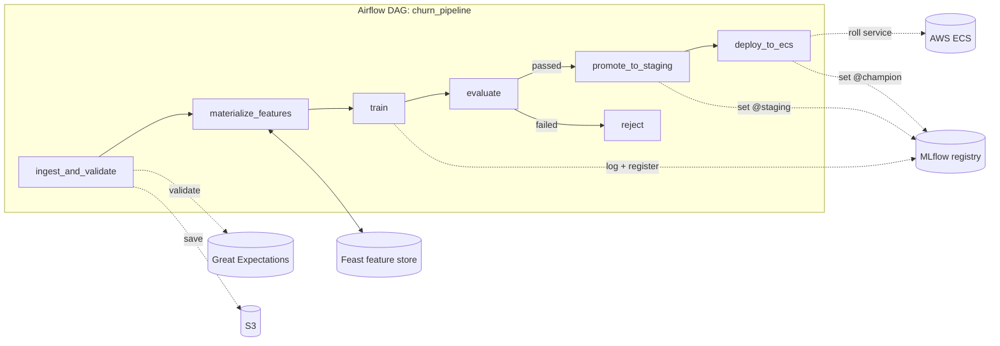
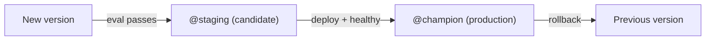
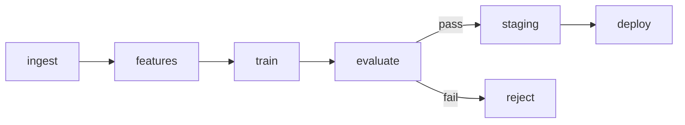

# Ship It: Promotion, Deployment, Testing & Publishing — The Final 6 Hours

*The capstone got your pipeline running. This guide turns it into something you can deploy, trust, document, and put your name on. It's the last block of the series.*

## What this assumes you already know

The whole series so far: **Airflow 3** (TaskFlow, branching, trigger rules, retries, Connections/Variables), **Feast**, **MLflow** (tracking, registry, and especially **aliases + tags** — which replaced the old "stages"), **Great Expectations**, **S3**, and the end-to-end **churn pipeline** you built in the capstone. This guide extends that same project; it doesn't rebuild it.

## What's new here

1. **Two-tier promotion** — auto-promote a passing model to a *staging* alias, separate from production.
2. **Deployment to ECS** — an Airflow task that ships the new model to a running container service via boto3.
3. **Tests** — pytest for DAG validation, structure, task logic, and data quality.
4. **Polish** — a README, docstrings, and an architecture diagram in Mermaid.
5. **Blog post** — a draft of "Building an End-to-End ML Pipeline."
6. **Publish** — GitHub, CI, badges, and sharing.

> **Heads-up on "Staging."** Your plan says "auto-promote to Staging." MLflow's fixed **stages** (`Staging`/`Production`) are **deprecated** — we covered this in the capstone. The current, equivalent move is to set a mutable **alias** named `staging` (plus a status tag). This guide does that; everywhere you'd have said "the Staging stage," read "the `staging` alias."

---

# Hour 1 — Model registry promotion

**Goal:** when evaluation passes, automatically mark the new model version as a *staging candidate* — distinct from what's actually serving production.

## 1.1 Why two tiers instead of one

In the capstone, a passing model went straight to `@champion` (production). That's fine for learning, but real teams want a gap between *"passed automated checks"* and *"serving live traffic."* That gap is where you run smoke tests, shadow traffic, or get a human sign-off. So we split promotion into two tiers:

- **`staging` alias** — set automatically when evaluation passes. Means "this version is a validated candidate." Low-risk; nothing in production changes.
- **`champion` alias** — set deliberately (here, at deploy time in Hour 2) when you're ready to serve it. This is the version production loads.

Both are just **aliases** (movable named pointers to a version) plus **tags** (key/value status labels) — the mechanism you already know.

## 1.2 Auto-promote to staging

This refines the capstone's `promote` task into `promote_to_staging`: set the `staging` alias on the new version and tag it.

```python
MLFLOW_URI = "http://host.docker.internal:5000"   # localhost outside Docker
MODEL_NAME = "churn-classifier"

@task
def promote_to_staging(eval_info: dict):
    from mlflow import MlflowClient
    client = MlflowClient(tracking_uri=MLFLOW_URI)
    v = str(eval_info["version"])

    client.set_registered_model_alias(MODEL_NAME, "staging", eval_info["version"])
    client.set_model_version_tag(MODEL_NAME, v, "validation_status", "passed")
    client.set_model_version_tag(MODEL_NAME, v, "roc_auc", f"{eval_info['new_auc']:.4f}")
    print(f"Version {v} promoted to @staging (roc_auc={eval_info['new_auc']:.3f}).")
    return {"version": eval_info["version"], "stage": "staging"}
```

The `reject` task is unchanged (tag `validation_status=rejected`). The branch from `evaluate` now routes to `promote_to_staging` or `reject`.

> **Gotcha — "staging" the alias is not "Staging" the stage.** If you call `client.transition_model_version_stage(...)` you're using the deprecated stages API, which is removed/disabled in current MLflow. Use `set_registered_model_alias(name, "staging", version)` instead. Same intent, current API.

> **Gotcha — aliases are mutable and singular per name.** Setting `staging` to a new version *moves* the alias off the old one — there's exactly one `@staging` at a time. That's the point (it always names the current candidate), but don't expect history from the alias; use tags or the version list for that.

## ✅ Hour 1 Exercise

1. Replace the capstone's direct-to-champion `promote` with `promote_to_staging` as above, keeping the threshold/champion-comparison gate in `evaluate`.
2. Run the DAG; in the MLflow UI confirm the new version holds the `staging` alias and the `validation_status=passed` tag.
3. **Stretch:** add a guard so `promote_to_staging` only runs if the version isn't already `@champion` (don't demote a live model to a mere candidate by accident).

---

## 🎤 Hour 1 — Interview Questions & Answers

**Q1 (conceptual). Why separate a "staging" promotion from a "production" promotion?**
To create a controlled gap between passing automated evaluation and serving live traffic. The staging tier marks a validated candidate you can smoke-test, shadow, or have reviewed; production promotion is the deliberate decision to serve it. Collapsing them into one step removes the chance to catch problems before they reach users.

**Q2 (gotcha). A candidate uses `transition_model_version_stage("Staging")`. What's wrong?**
That's the deprecated stages API; MLflow replaced fixed stages with aliases and tags. The current approach is `set_registered_model_alias(name, "staging", version)` for a movable pointer plus tags for status. Using the stages API on current MLflow will fail or is disabled.

**Q3 (practical). How do you record *why* a version is in staging, given aliases don't carry history?**
With tags. An alias is a single mutable pointer, so it can't tell you the version's lineage of decisions. Tags like `validation_status=passed` and `roc_auc=0.83` annotate the specific version durably, and the registry's version list preserves the sequence. Aliases say "which one is current"; tags say "why."

**Q4 (conceptual). If `staging` and `champion` both point at version 5, what does that mean?**
That the same validated candidate is also the one serving production. Aliases are independent pointers, so they can coincide. It's common right after a deploy: you validated v5 (`staging`), then promoted it to serve (`champion`). They'll diverge again when a new candidate gets `staging`.

**Q5 (practical). Where in the DAG does staging promotion sit, and what feeds it?**
Downstream of `evaluate`, on the "passed" side of the branch. It consumes the eval result (the version and its metric) and sets the alias/tags. Its sibling on the "failed" side tags the version rejected. A join task after both must use `none_failed_min_one_success` so it runs regardless of which branch executed.

---

# Hour 2 — Deployment task (ECS)

**Goal:** an Airflow task that ships the staging model to a running container service on AWS ECS, then marks it production.

## 2.1 Why a container service

A trained model is just a file until something serves predictions from it. The common pattern is to wrap the model in a small web service, package that as a **container image** (a self-contained, runnable bundle of your code plus its dependencies), and run it on infrastructure that keeps it alive and scales it. **AWS ECS (Elastic Container Service)** is that infrastructure: it runs and manages containers for you.

The vocabulary you need:

- **ECR (Elastic Container Registry)** — AWS's storage for container images. You push your model-serving image here, tagged with a version.
- **Task definition** — a blueprint describing *which image to run* and with what CPU/memory/env. Each change creates a new numbered **revision**.
- **Service** — the long-running manager that keeps N copies of a task definition running and replaces them when you deploy a new revision (a **rolling deployment**).

So "deploy a new model" means: push a new image → register a new task-definition revision pointing at it → tell the service to use that revision.

## 2.2 Why boto3 here (not an Airflow operator)

Airflow's Amazon provider has `EcsRunTaskOperator` for running a *one-off* task on ECS, but there isn't a dedicated operator for *updating a long-running service* with a new revision. That's a direct AWS API call, which is exactly what your plan specifies ("ECS API + boto3"). We use Airflow's **`EcsHook`** to get a boto3 ECS client that authenticates through your Airflow `aws_default` Connection — so no credentials in code.

## 2.3 The deployment task

Assume your CI built and pushed the serving image to ECR as `…/churn-serve:<tag>` (the model can be baked in, or loaded at startup via `models:/churn-classifier@staging`). The task registers a new revision with that image and rolls the service.

```python
@task
def deploy_to_ecs(staging_info: dict, image_uri: str):
    from airflow.providers.amazon.aws.hooks.ecs import EcsHook
    from mlflow import MlflowClient

    cluster = "ml-cluster"
    service = "churn-serve"
    family  = "churn-serve"               # task-definition family name

    ecs = EcsHook(aws_conn_id="aws_default").conn   # boto3 ECS client via Airflow conn

    # 1) read the current task definition
    svc = ecs.describe_services(cluster=cluster, services=[service])["services"][0]
    current_td = ecs.describe_task_definition(
        taskDefinition=svc["taskDefinition"])["taskDefinition"]

    # 2) copy it, swap the image, strip read-only fields, register a new revision
    container = current_td["containerDefinitions"]
    container[0]["image"] = image_uri      # point at the new model image
    for key in ("taskDefinitionArn", "revision", "status", "requiresAttributes",
                "compatibilities", "registeredAt", "registeredBy"):
        current_td.pop(key, None)
    new_td = ecs.register_task_definition(**current_td)
    new_arn = new_td["taskDefinition"]["taskDefinitionArn"]

    # 3) roll the service onto the new revision
    ecs.update_service(cluster=cluster, service=service,
                       taskDefinition=new_arn, forceNewDeployment=True)

    # 4) wait until the service is healthy before declaring success
    ecs.get_waiter("services_stable").wait(cluster=cluster, services=[service])

    # 5) now it's live — mark this version production (champion)
    client = MlflowClient(tracking_uri=MLFLOW_URI)
    client.set_registered_model_alias(MODEL_NAME, "champion", staging_info["version"])
    print(f"Deployed {image_uri}; version {staging_info['version']} is now @champion.")
```

Wire it after staging promotion: `promote_to_staging() >> deploy_to_ecs(...)`.

> **Gotcha — never deploy `:latest`.** Tag images with a unique, traceable tag (e.g., the MLflow version or a git SHA), not `:latest`. With `:latest` you can't tell which model is running, rollbacks are ambiguous, and the service may or may not pull the new bits. Unique tags make deploys auditable and reversible.

> **Gotcha — `register_task_definition` rejects read-only keys.** `describe_task_definition` returns fields (`taskDefinitionArn`, `revision`, `status`, `compatibilities`, `registeredAt`, …) that you must strip before re-registering, or the API errors. The `pop` loop above does this.

> **Gotcha — flip the alias only after the service is stable.** Set `@champion` *after* `services_stable` returns. If you flip it first and the deployment fails to stabilize, your registry says "this is production" while the old container is still serving — a lie that breaks rollback reasoning. Order matters.

> **Gotcha — rollback is the same call in reverse.** To roll back: `update_service(..., taskDefinition=<previous_arn>, forceNewDeployment=True)` and reassign `@champion` to the previous version. Keep the previous revision ARN around (it's in the task-definition history) so rollback is one step.

## ✅ Hour 2 Exercise

1. Create (or mock) an ECS cluster + service + task definition and an `aws_default` Connection. Implement `deploy_to_ecs` and wire it after `promote_to_staging`.
2. Run it and confirm a new task-definition revision is registered and the service rolls to it, then the MLflow `@champion` alias moves to the deployed version.
3. **No AWS?** Mock `EcsHook(...).conn` in a unit test (Hour 3) and assert `register_task_definition` and `update_service` are called with the right arguments — you can fully test the logic without an AWS account.
4. **Stretch:** add a `rollback_on_failure` callback that, if the waiter times out, updates the service back to the previous revision and reassigns `@champion`.

---

## 🎤 Hour 2 — Interview Questions & Answers

**Q1 (conceptual). Walk through what "deploy a new model to ECS" actually does.**
Build and push a new container image (with or loading the model) to ECR, register a new task-definition revision pointing at that image, then update the ECS service to use the new revision. The service performs a rolling deployment — starting new tasks on the new revision and draining the old ones — so traffic shifts without downtime.

**Q2 (practical). Why use boto3/`EcsHook` instead of an Airflow ECS operator for this?**
Airflow's `EcsRunTaskOperator` runs one-off tasks, but there's no dedicated operator for updating a long-running service with a new revision — that's a direct API call. `EcsHook` gives a boto3 ECS client authenticated through the Airflow `aws_default` Connection, so you call `register_task_definition`/`update_service` directly while keeping credentials out of code.

**Q3 (gotcha). Why is deploying `:latest` discouraged?**
It destroys traceability and safe rollback: you can't tell which model version is running, and a reused tag may not reliably trigger a pull of new bits. Unique, immutable tags (MLflow version or git SHA) make every deploy identifiable and reversible.

**Q4 (gotcha). Why set the `@champion` alias only after the service is stable?**
Because the alias declares what's serving production. If you set it before confirming the deployment is healthy and the rollout then fails, the registry claims a version is live that isn't, breaking rollback and monitoring logic. Waiting for `services_stable` keeps the registry's truth aligned with reality.

**Q5 (practical). How would you implement rollback for this deployment?**
Re-run `update_service` with the previous task-definition revision ARN and `forceNewDeployment=True`, then reassign `@champion` to the previous model version. Because each register creates a numbered revision, the prior ARN is preserved in history — keep it (or look it up) so rollback is a single, deterministic step.

---

# Hour 3 — Tests

**Goal:** add automated tests so a broken DAG or bad data is caught before it runs.

## 3.1 Why test a pipeline

A DAG is code, and untested code breaks in production. Two failure classes matter: **the DAG itself is wrong** (won't import, missing a task, no retries) and **the data is wrong** (caught by validation, but worth testing too). Tests catch the first class in seconds — far faster than starting Airflow and clicking around — and they're what lets you change the pipeline confidently later.

## 3.2 DAG validation tests

The fastest, highest-value tests check that DAGs load and meet your standards. In **Airflow 3** the `DagBag` (the object that loads all DAG files) moved import paths.

```python
# tests/test_dag_validation.py
import pytest
from airflow.dag_processing.dagbag import DagBag   # Airflow 3 path
# (Airflow 2 used: from airflow.models import DagBag)

@pytest.fixture(scope="session")
def dagbag():
    return DagBag(include_examples=False)

def test_no_import_errors(dagbag):
    # catches syntax errors and missing-package imports across all DAGs
    assert dagbag.import_errors == {}, f"Import errors: {dagbag.import_errors}"

def test_dag_present_and_tagged(dagbag):
    dag = dagbag.get_dag("churn_pipeline")
    assert dag is not None
    assert dag.tags, "DAG should be tagged"
    assert dag.catchup is False, "catchup must be False"

def test_retries_configured(dagbag):
    dag = dagbag.get_dag("churn_pipeline")
    for task in dag.tasks:
        assert task.retries is not None, f"{task.task_id} has no retries set"
```

> **Gotcha — import-error tests need your environment's packages.** `test_no_import_errors` only passes if every package your DAGs import (feast, mlflow, great_expectations, the amazon provider) is installed where the tests run. That's a feature: it catches "works on my machine" missing-dependency bugs in CI.

## 3.3 Structure tests

Verify the graph matches your design, so an accidental rewiring is caught.

```python
def test_structure(dagbag):
    dag = dagbag.get_dag("churn_pipeline")
    assert {"ingest_and_validate", "train", "evaluate", "deploy_to_ecs"} <= set(dag.task_ids)
    # evaluate should feed the branch gate
    assert "gate" in dag.get_task("evaluate").downstream_task_ids
```

## 3.4 Unit tests for task logic

The most valuable tests target your *pure logic* — extracted into plain functions so they're testable without Airflow or AWS. For example, the promotion decision:

```python
# in your dag module: a pure function the task calls
def decide_promotion(new_auc: float, champion_auc: float, threshold: float) -> bool:
    return new_auc >= threshold and new_auc > champion_auc

# tests/test_logic.py
from dags.churn_pipeline import decide_promotion

def test_promote_when_better_and_above_bar():
    assert decide_promotion(0.85, 0.82, 0.80) is True

def test_reject_when_below_bar():
    assert decide_promotion(0.78, 0.50, 0.80) is False

def test_reject_when_not_better_than_champion():
    assert decide_promotion(0.81, 0.83, 0.80) is False
```

For tasks that call external systems (MLflow, ECS, S3), **mock** them — replace the real client with a fake so the test runs offline and asserts the right calls:

```python
from unittest.mock import patch, MagicMock

@patch("airflow.providers.amazon.aws.hooks.ecs.EcsHook")
def test_deploy_calls_update_service(mock_hook):
    client = mock_hook.return_value.conn
    client.describe_services.return_value = {"services": [{"taskDefinition": "arn:old"}]}
    client.describe_task_definition.return_value = {
        "taskDefinition": {"containerDefinitions": [{"image": "old"}], "family": "churn-serve"}}
    client.register_task_definition.return_value = {"taskDefinition": {"taskDefinitionArn": "arn:new"}}
    # ... call the function, then:
    # client.update_service.assert_called_once()
```

## 3.5 Integration test with `dag.test()`

`dag.test()` runs the whole DAG in-process once — great for an end-to-end smoke test with small data and mocked externals. It returns a run you can inspect.

```python
def test_dag_runs_end_to_end(dagbag):
    dag = dagbag.get_dag("churn_pipeline")
    dag.test()        # raises if any task fails; mock externals first
```

> **Gotcha — `dag.test()` runs real task code.** It will actually call MLflow, AWS, etc. unless you mock them. For a true unit/integration test, patch the external clients (or point them at local fakes/MinIO/a local MLflow), or it'll fail or hit real services.

## 3.6 Data quality tests

You already run Great Expectations *inside* the pipeline (Hour 2 of the capstone). For tests, you can also assert data properties directly on a sample — and in CI, validate that your expectation suite itself loads and runs against a fixture. The principle: validate the data contract both at runtime (GX in the DAG) and at test time (against known-good and known-bad fixtures) so you know your checks actually catch what they should.

## 3.7 Running the tests

```bash
# with the Astro CLI (runs pytest inside the Airflow image, with deps available)
astro dev pytest

# or directly, with AIRFLOW_HOME set and deps installed
pytest tests/
```

## ✅ Hour 3 Exercise

1. Add `tests/` with: an import-error test, a tags/catchup/retries test, a structure test, and at least two pure-logic unit tests (e.g., `decide_promotion`).
2. Add one mocked test for an external-calling task (ECS or MLflow) that asserts the right client method is called — no real cloud needed.
3. Run `astro dev pytest` (or `pytest`) and get them green. Then break a DAG (remove a task) and confirm the structure test fails.
4. **Stretch:** add a data-quality test that runs your GX suite against a deliberately bad fixture and asserts it *fails* (proving your checks work).

---

## 🎤 Hour 3 — Interview Questions & Answers

**Q1 (practical). What's the single most valuable Airflow test and why?**
The DAG import-error test (`assert dagbag.import_errors == {}`). It catches syntax errors and missing dependencies across all DAGs in seconds, without starting Airflow, and a DAG that can't import can't run at all. It's the cheapest test with the broadest coverage, which is why it's the standard first test in CI.

**Q2 (conceptual). Why extract task logic into pure functions, and how does that help testing?**
Pure functions (inputs → output, no side effects) can be tested directly with plain assertions, without Airflow, a database, or cloud access. Keeping the decision logic (e.g., the promotion rule) out of the task body and in a function makes it fast and deterministic to test, while the task becomes thin glue you cover with a mocked integration test.

**Q3 (practical). How do you test a task that calls AWS or MLflow without hitting the real services?**
Mock the client: patch `EcsHook`/`MlflowClient` so the test uses a fake, configure its return values, run the function, and assert it called the right methods with the right arguments. This makes the test offline, fast, and deterministic, and verifies behavior (the calls made) rather than external state.

**Q4 (gotcha). A colleague's `dag.test()` integration test hits production AWS. What went wrong and how is it fixed?**
`dag.test()` executes real task code, so unmocked external clients call real services. Fix it by patching the external clients (or pointing them at local stand-ins like MinIO/local MLflow) before calling `dag.test()`, and ensure no production credentials are configured in the test environment.

**Q5 (gotcha). The import-error test passes locally but fails in CI. Likely cause?**
A dependency installed locally but missing in CI. The import test loads DAGs, which import feast/mlflow/great_expectations/providers; if CI's environment lacks one, the import fails. The fix is to install the same requirements in CI — which is exactly the "works on my machine" bug the test exists to catch.

---

# Hour 4 — Polish: docs, diagram, README

**Goal:** make the project understandable and runnable by someone who's never seen it — including future-you and a hiring manager.

## 4.1 Why docs are part of "done"

A pipeline nobody can set up or reason about isn't finished. The README is the first (often only) thing a reviewer reads; a clear one signals the project is real and well-engineered. Good docs also force you to articulate your design, which surfaces gaps.

## 4.2 What a good README contains

In order: a one-line description and the problem it solves; an **architecture diagram**; prerequisites; setup and run commands (exact, copy-pasteable); the project layout; how to test; results (a metric, a screenshot of the MLflow run); and "what I'd do next." Lead with the diagram — people understand a picture faster than prose.

## 4.3 The architecture diagram in Mermaid

**Mermaid** is a text-to-diagram language: you write the diagram as code in a fenced ` ```mermaid ` block, and GitHub (and many blog platforms) render it automatically — no image files to maintain. Here's the pipeline as a flowchart you can paste into your README:



A second small diagram for the promotion/deploy lifecycle helps too:



> **Gotcha — Mermaid renders on GitHub, but check the platform.** GitHub READMEs render ` ```mermaid ` blocks natively. Some blog platforms don't — for those, export the diagram to SVG/PNG (the Mermaid Live Editor does this) and embed the image. Don't assume; preview before publishing.

## 4.4 Docstrings

A docstring (short for documentation string) is a built-in string literal used to document a specific segment of code, such as a function, class, or module. Unlike standard comments that are ignored by the compiler, docstrings are retained in memory and can be accessed dynamically at runtime.

Put the project spec (your Hour 1 capstone five-question answers) as the DAG's module docstring, and a one-line docstring on each task saying what it does and what it returns. The DAG file should read like a table of contents for the pipeline.

## ✅ Hour 4 Exercise

1. Write a README with the sections in 4.2, including the Mermaid architecture diagram (adapt it to your task names). Make sure every setup/run command actually works from a clean clone.
2. Add a module docstring (your project spec) and per-task docstrings.
3. Preview the README on GitHub (or a Markdown previewer) and confirm the Mermaid diagram renders.
4. **Stretch:** add a "Results" section with your best ROC-AUC and a screenshot of the MLflow run page.

---

## 🎤 Hour 4 — Interview Questions & Answers

**Q1 (conceptual). Why is a README considered part of finishing a project, not an afterthought?**
Because a project others can't set up or understand has limited value, and the README is the primary interface to your work — often the only thing a reviewer reads. It demonstrates engineering maturity, makes the project reproducible, and forces you to articulate the design, which often reveals gaps.

**Q2 (practical). What belongs in the README and in what order?**
A one-line description and problem, an architecture diagram, prerequisites, exact setup/run commands, project layout, testing instructions, results, and next steps — diagram early. The ordering moves from "what is this and why" to "how do I run it" to "what did it achieve," matching how a new reader's questions arrive.

**Q3 (conceptual). What's the advantage of a Mermaid diagram over an image?**
It's text, so it lives in version control, diffs cleanly, updates with the code, and needs no binary asset or external tool. GitHub renders it inline. The trade-off is that not every platform renders Mermaid, so for those you export to an image.

**Q4 (practical). What makes setup instructions trustworthy?**
That they work verbatim from a clean clone — exact, copy-pasteable commands with prerequisites stated, no hidden local state. The test is literally running them in a fresh environment. Vague or assumed steps ("configure your AWS," "set up MLflow") without specifics are where reproducibility breaks.

**Q5 (gotcha). You add a Mermaid diagram and it shows as raw text on your blog. Why?**
The platform doesn't render Mermaid. GitHub does, but many blogs don't process ` ```mermaid ` fences. Export the diagram to SVG/PNG (e.g., via the Mermaid Live Editor) and embed it as an image there, keeping the Mermaid source in the repo README.

---

# Hour 5 — Blog post draft

**Goal:** draft "Building an End-to-End ML Pipeline" — the post that turns your project into a portfolio piece.

## 5.1 Why write it

Writing consolidates what you learned (you only understand what you can explain), demonstrates your skills to people who'll never read your code, and creates a durable portfolio artifact. A good engineering post is often worth more professionally than the repo alone.

## 5.2 The structure that works

A reliable shape for a project walkthrough:

1. **The hook / problem** — one paragraph: what you built and why it matters (predicting churn end-to-end, automated and reproducible). Make the reader want the rest.
2. **Architecture at a glance** — drop the Mermaid diagram (or its exported image) and name the tools and their roles in two sentences.
3. **Walk the pipeline stage by stage** — for each stage (ingest+validate, feature store, train+log, evaluate+promote, deploy), give a *short* code snippet and, more importantly, the **decision and the why** (why a feature store, why aliases over stages, why validate before training). Decisions are what readers remember; code they can get from the repo.
4. **The gotchas you hit** — the most valuable section. Real problems and fixes (the `localhost`-vs-`host.docker.internal` trap, the branch trigger-rule skip, GX version churn). This is what proves you actually built it.
5. **Results** — your metric, a screenshot, what "promoted" looked like.
6. **What's next** — honest limitations and next steps (monitoring, retraining triggers, real timestamps).
7. **Links** — the GitHub repo, and credit your sources.

## 5.3 A starter draft

Use this as a skeleton to fill (keep code snippets short — link the repo for full code):

```markdown
# Building an End-to-End ML Pipeline with Airflow, Feast, and MLflow

Most ML tutorials stop at `model.fit()`. Production starts there. In this post I
build a churn-prediction pipeline that ingests and validates data, manages
features through a feature store, trains and versions a model, and promotes it
only when it clears a quality bar — all orchestrated by Airflow and shipped to a
container service.

## Architecture

Airflow orchestrates; Great Expectations validates; Feast serves features; MLflow
tracks and registers; ECS runs the deployed model.

## Stage 1 — Ingest & validate
<why validation matters, the GX check, one snippet, the gotcha you hit>

## Stage 2 — Features with Feast
<why a feature store; point-in-time joins in one paragraph>

## Stage 3 — Train & log
<signature + registry; one snippet; the log_model version gotcha>

## Stage 4 — Evaluate & promote
<threshold + champion comparison; aliases not stages; the branch trigger-rule gotcha>

## Stage 5 — Deploy
<ECS rolling update via boto3; flip alias after stable; the :latest gotcha>

## Gotchas I hit
<3–5 real ones with fixes>

## Results & next steps
<metric, screenshot, limitations, what's next>

Repo: <github link>
```

> **Gotcha — set a canonical URL when cross-posting.** If you publish the same post on your site and on Medium/Hashnode/Dev.to, set the **canonical URL** (a tag telling search engines which copy is the original) to your preferred version. Otherwise search engines see duplicate content and may rank neither well. All three platforms support a canonical-URL field.

> **Gotcha — redact secrets and account IDs in screenshots and snippets.** Blog screenshots of the AWS console or MLflow can leak account numbers, ARNs, bucket names, or tokens. Crop or blur them, and double-check pasted code for hard-coded credentials before publishing.

## ✅ Hour 5 Exercise

1. Fill the skeleton into a complete draft (~1,000–1,500 words). Prioritize the *decisions and gotchas*; keep snippets short.
2. Embed the architecture diagram (Mermaid if the platform renders it, else the exported image).
3. Read it once as a stranger: could they understand what you built and why without your repo? Cut anything that needs insider context.
4. **Stretch:** write a two-sentence summary and a punchy title variant for sharing.

---

## 🎤 Hour 5 — Interview Questions & Answers

**Q1 (conceptual). Why is writing about a project professionally valuable beyond the code itself?**
It reaches people who won't read your code (recruiters, peers), demonstrates communication and reasoning, and consolidates your own understanding — explaining a system reveals whether you actually understand it. A clear post is a durable, discoverable portfolio artifact that the repo alone isn't.

**Q2 (practical). Which section of a project write-up tends to be most valuable to readers, and why?**
The gotchas — the real problems hit and how they were fixed. They prove the work was actually done (not copied), teach readers things tutorials omit, and showcase debugging skill. Anyone can describe a happy path; specific, hard-won fixes signal genuine experience.

**Q3 (gotcha). What's a canonical URL and why set one when cross-posting?**
It's an HTML tag/field declaring which copy of a page is the original. When you publish the same post in several places, search engines may treat them as duplicate content and rank none well; setting the canonical to your preferred copy consolidates ranking signals to it. Major blog platforms expose a canonical-URL setting for this.

**Q4 (conceptual). How should code snippets be used in a walkthrough post?**
Sparingly and short — illustrative, not exhaustive. The full code lives in the linked repo; the post's value is the reasoning around the code (why this design, what broke, what you chose). Long code dumps lose readers; a focused snippet plus the decision behind it keeps them.

**Q5 (practical). What must you check before publishing screenshots from cloud consoles?**
That they don't leak sensitive identifiers — account numbers, ARNs, bucket names, access keys, tokens. Crop or blur sensitive regions and scan any pasted code for hard-coded secrets. Treat anything visible in a screenshot as public the moment you publish.

---

# Hour 6 — Publish

**Goal:** push the code to GitHub, publish the post, and share it — with the polish (CI, badges) that makes it look finished.

## 6.1 Prepare the repo

Before pushing, make the repo clean and safe:

- **`.gitignore`** — exclude secrets and bulky/generated artifacts: `.env`, `mlruns/`, `mlartifacts/`, `mlflow.db`, `include/data/*.parquet`, `__pycache__/`, the Feast registry/online files. Commit *code and config*, not data and credentials.
- **`LICENSE`** — pick one (MIT is a common permissive default) so others know the terms.
- **`requirements.txt`** — pinned, so the repo actually installs.
- **`.env.example`** — a template of needed variables (no real values) so others know what to set.

> **Gotcha — never commit secrets; rotate if you do.** AWS keys, tokens, or a `.env` slipping into git history is a real incident — git history persists even after deletion. GitHub's secret scanning may flag it, but assume any committed secret is compromised: **rotate it immediately**. The `.gitignore` above is your first line of defense.

> **Gotcha — don't commit datasets and MLflow artifacts.** They bloat the repo and can carry licensing or privacy issues. Ignore `mlruns/`, `mlartifacts/`, and data files; if you must share data, link to its source or use Git LFS / external storage.

## 6.2 Continuous integration (ties to Hour 3)

Add a GitHub Actions workflow so your tests run on every push/PR — this both protects the project and earns a status badge.

```yaml
# .github/workflows/ci.yml
name: CI
on: [push, pull_request]
jobs:
  test:
    runs-on: ubuntu-latest
    steps:
      - uses: actions/checkout@v4
      - uses: actions/setup-python@v5
        with: { python-version: "3.12" }
      - run: pip install -r requirements.txt
      - run: pytest tests/
```

## 6.3 README badges

**Badges** are the small status images at the top of a README (build passing, license, Python version). They come from **shields.io** and communicate project health at a glance. The CI badge points at your workflow:

```markdown


```

> **Gotcha — the CI badge URL must match your repo and workflow filename.** The path includes your username, repo, and the exact workflow file (`ci.yml`). A wrong path renders a broken/"unknown" badge. Copy the badge snippet from the Actions tab's "Create status badge" button to get it exact.

## 6.4 Push, publish, share

1. **Push** to GitHub with a clean history and a meaningful final commit.
2. **Confirm** CI runs green and the README (diagram + badges) renders on the repo page.
3. **Publish** the post (your site / Hashnode / Medium / Dev.to), linking the repo and setting the canonical URL if cross-posting.
4. **Share** where your audience is — LinkedIn, relevant communities, your network. Lead with the problem and the diagram, not "I made a thing."

## ✅ Hour 6 Exercise — the ship checklist

Complete every item:

1. `.gitignore`, `LICENSE`, pinned `requirements.txt`, and `.env.example` present; no secrets or data committed (check `git status` and history).
2. CI workflow added; a push shows tests running and passing green.
3. README renders on GitHub with the architecture diagram and a working CI badge.
4. Blog post published, linking the repo (canonical URL set if cross-posted).
5. Post shared in at least one place.
6. **Final reflection:** write three sentences on what you'd build next (monitoring? automated retraining? real-time features?). That's the seed of your next project — and a great closing line for the blog post.

---

## 🎤 Hour 6 — Interview Questions & Answers

**Q1 (gotcha). You accidentally committed an AWS key. What do you do?**
Treat it as compromised and rotate/revoke it immediately — deleting the file or rewriting history is not enough, because the key was exposed and history persists. Then add the file to `.gitignore`, and consider repo secret scanning to prevent recurrence. Speed matters: assume it was harvested the moment it landed.

**Q2 (practical). What should and shouldn't go into the Git repo for this project?**
In: code, DAGs, tests, config templates (`.env.example`), pinned requirements, README, CI, license. Out: secrets (`.env`), datasets, and generated artifacts (`mlruns/`, `mlartifacts/`, the MLflow DB, Feast online/registry files). Commit what defines the project; exclude what's secret, large, or regenerated.

**Q3 (conceptual). What does adding CI to the repo accomplish?**
It runs your tests automatically on every push/PR, catching import errors, structure regressions, and logic bugs before they merge — protecting the project and anyone reusing it. It also produces a visible status badge that signals health. CI turns your Hour 3 tests from a one-time check into a continuous guarantee.

**Q4 (practical). How do README badges help, and where does the CI badge come from?**
They communicate project status at a glance — build passing, license, language version — which builds trust quickly. The CI status badge is generated by GitHub Actions and points at your workflow file (`…/actions/workflows/ci.yml/badge.svg`); other badges come from shields.io. The Actions tab provides the exact badge markdown.

**Q5 (conceptual). Why set a canonical URL and lead sharing with the problem rather than the tooling?**
The canonical URL prevents duplicate-content dilution across cross-posts by naming the original. Leading with the problem ("predicting churn end-to-end, automatically") hooks a broader audience than tool names do — people care about the outcome first; the stack is supporting detail. It's the difference between "interesting" and "scrolled past."

---

# 📋 Gotchas summary table

| # | Stage | Gotcha | Fix |
|---|-------|--------|-----|
| 1 | Promotion | `transition_model_version_stage` (deprecated stages) | Use `set_registered_model_alias(name, "staging", version)` |
| 2 | Promotion | Expecting history from an alias | Alias is one mutable pointer; use tags + version list for history |
| 3 | Deploy | Deploying `:latest` | Tag images uniquely (MLflow version / git SHA) |
| 4 | Deploy | `register_task_definition` rejects read-only keys | Strip `taskDefinitionArn`, `revision`, `status`, `compatibilities`, etc. |
| 5 | Deploy | Flipping `@champion` before service is healthy | Set alias only after `services_stable` waiter returns |
| 6 | Deploy | No rollback plan | `update_service` to previous revision + reassign alias |
| 7 | Tests | Import test fails in CI only | Install all DAG dependencies in CI |
| 8 | Tests | `dag.test()` hits real AWS/MLflow | Mock external clients before running it |
| 9 | Tests | Logic buried in task bodies | Extract pure functions; test them directly |
| 10 | Docs | Mermaid shows as raw text on a blog | Export to SVG/PNG for platforms that don't render Mermaid |
| 11 | Docs | Setup steps don't work from a clean clone | Verify exact commands in a fresh environment |
| 12 | Blog | Duplicate-content penalty when cross-posting | Set the canonical URL to the original |
| 13 | Blog | Secrets/account IDs visible in screenshots | Crop/blur; scan snippets for credentials |
| 14 | Publish | Committed a secret | Rotate/revoke immediately; `.gitignore`; enable scanning |
| 15 | Publish | Committed data/artifacts | Ignore `mlruns/`, `mlartifacts/`, data; link source or use LFS |
| 16 | Publish | Broken CI badge | Match the badge URL to your repo + workflow filename exactly |

---

# 🗂️ Quick reference card

### Two-tier promotion (aliases, not stages)
```python
from mlflow import MlflowClient
c = MlflowClient(tracking_uri="http://host.docker.internal:5000")
c.set_registered_model_alias("churn-classifier", "staging", version)     # candidate
c.set_model_version_tag("churn-classifier", str(version), "validation_status", "passed")
# at deploy time, once live:
c.set_registered_model_alias("churn-classifier", "champion", version)    # production
# serve:  mlflow.sklearn.load_model("models:/churn-classifier@champion")
```

### ECS deploy (boto3 via EcsHook)
```python
from airflow.providers.amazon.aws.hooks.ecs import EcsHook
ecs = EcsHook(aws_conn_id="aws_default").conn
td = ecs.describe_task_definition(taskDefinition=...)["taskDefinition"]
td["containerDefinitions"][0]["image"] = new_image_uri
for k in ("taskDefinitionArn","revision","status","requiresAttributes",
          "compatibilities","registeredAt","registeredBy"): td.pop(k, None)
arn = ecs.register_task_definition(**td)["taskDefinition"]["taskDefinitionArn"]
ecs.update_service(cluster="c", service="s", taskDefinition=arn, forceNewDeployment=True)
ecs.get_waiter("services_stable").wait(cluster="c", services=["s"])
```

### Tests (Airflow 3)
```python
from airflow.dag_processing.dagbag import DagBag      # Airflow 3 import path
db = DagBag(include_examples=False)
assert db.import_errors == {}                          # no import errors
dag = db.get_dag("churn_pipeline"); assert dag.catchup is False
# pure-logic unit test + mocked external test (patch EcsHook / MlflowClient)
# integration: dag.test()  (mock externals first)
```
Run: `astro dev pytest`  (or `pytest tests/`)

### Mermaid diagram (renders on GitHub)
````markdown

````

### Repo hygiene
```gitignore
.env
mlruns/
mlartifacts/
mlflow.db
include/data/*.parquet
__pycache__/
```
Add: `LICENSE`, pinned `requirements.txt`, `.env.example`, `.github/workflows/ci.yml`.

### Badges
```markdown


```

### Ship checklist
Clean repo (no secrets/data) → CI green → README renders (diagram + badges) → post published (canonical set) → shared.

---

*That's the series. You went from "what's a DAG" to a tested, documented, deployed, and published end-to-end ML pipeline. The pattern — orchestrate, validate, version, gate, deploy, prove it — is the job. Go build the next one.*
